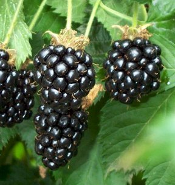
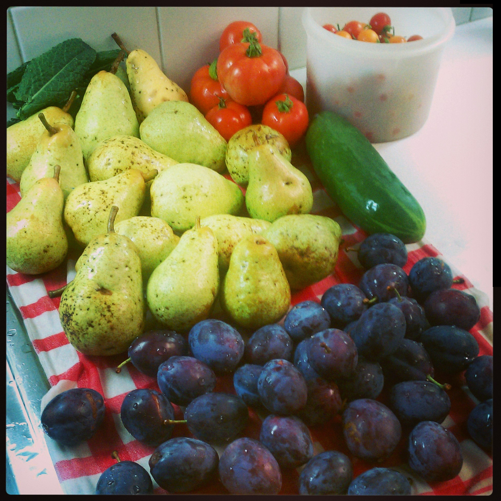

Hiatt Gardens
============

Welcome to the path to healthy eating. We love to garden and cook with what grows.

This was a picture of our garden just a few weeks after planting it.

Some of our plants currently growing:

- winter kale
- rainbow swiss chard
- variety of hardy lettuce

We know that you will enjoy looking around. Please let us know if you have any questions.

About The Gardens
===================

Surrounded by wildlife, trees and ponds makes our land the best place to grow organic fruit, vegetables, and herbs. We try to have a variety of things growing at most times of the year.

Cute little people help us give the plants plenty of love and care while they are growing. Keeping weeds down and pests away the organic way, by getting dirty.

FRUIT: 

 - three apple varieties
 - italian prunes
 - honey plums
 - grapes
 - pears
 - hairless & regular kiwi

BERRIES: 

 - blackberries
 - strawberries             
 - blueberries           
 - boysenberries
 - huckleberries                      

VEGETABLES:

 - variety of lettuces
 - rainbow swiss chard
 - kale
 - beets
 - carrots
 - cucumber
 - yellow peppers
 - bell peppers
 - tomatoes
 - zucchini
 - french beans
 - sugar peas
 - and much more.....

Contact The Gardeners
===================

Hiatt Gardens is happy to assist you with any questions regarding gardening, or how to use garden grown produce. 
For more information, please see my [Google Site](https://sites.google.com/site/cmae2323/ "Google Site").

- - - 

Hours:

 - Mon thru Fri: 10 AM - 6 PM
 - Weekends: Various

Order Fresh Produce
===================

Stop by and order fresh organic produce during the season to be sure to get adequate nutrients for your family.
We are proud to offer highest quality, fresh fruit, vegetables and herbs.

You can also arrange for a services trade and work in the garden for your vegetables!!

Come during the fall and participate in our apple harvest and Cider Press festivities!

